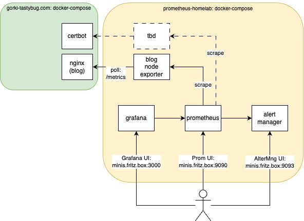

[AlertManager](http://minis.fritz.box:9093) \
[Prometheus](http://minis.fritz.box:9090) \
[Minis NodeExporter](http://minis.fritz.box:9100)

# Prometheus Homelab Stack

## Start and Stop

* `docker compose up -d --force-recreate --remove-orphans`, verify with curl localhost:9090
* `docker compose down`
