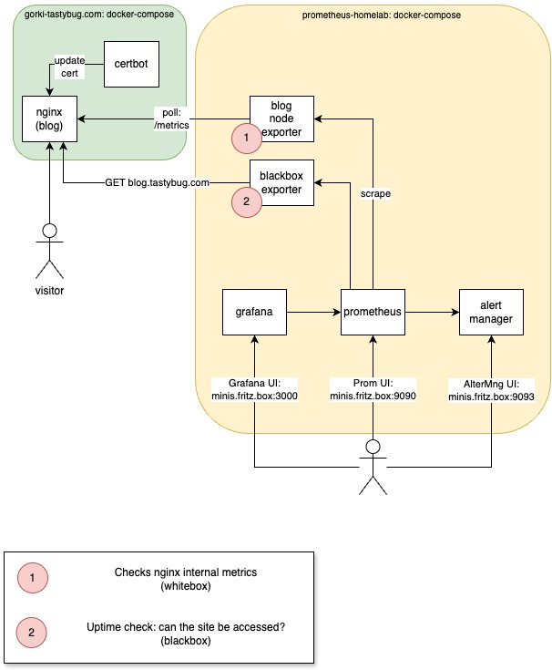

[AlertManager](http://minis.fritz.box:9093) \
[Prometheus](http://minis.fritz.box:9090) \
[Grafana](http://minis.fritz.box:3000)

# Prometheus Homelab Stack

## Start and Stop

* `docker compose up -d --force-recreate --remove-orphans`, verify with curl localhost:9090
* `docker compose down`

### Blackbox Nodeexporter?

Blackbox is used to query the blog from the perspective of the user. Checks that the index can be queried
and that the certificate is not expired.

This is what Prometheus sees: `curl 'http://localhost:9115/probe?target=blog.tastybug.com&module=http_2xx' | less`
